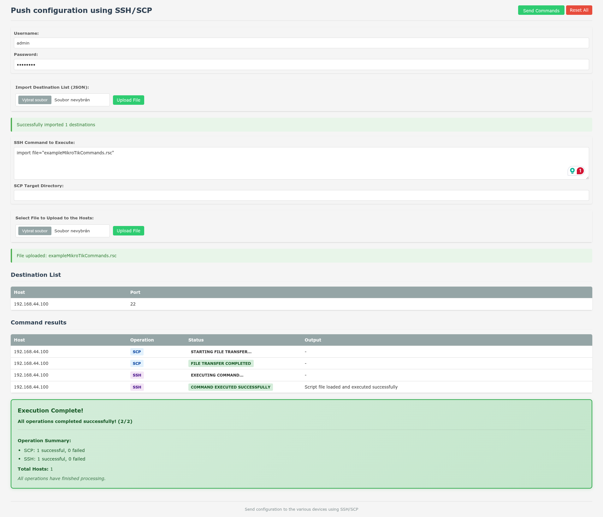

# netConfigure

A web-based SSH/SCP configuration management tool for deploying files and executing commands across multiple remote hosts simultaneously.



## Required applications
- sshpass
- ssh
- scp

## Usage
### Startup options
- listenAddr string, Server listen address (default all)
- listenPort int, Server listen port (default 8080)


### 1. Authentication
- Enter your SSH username and password in the configuration section

### 2. Import Destination Hosts
- Prepare a JSON file containing your host configurations. A port value is optional:
```json
[
  {
    "address": "192.168.1.100",
    "port": 22
  },
  {
    "address": "server2.example.com",
    "port": 2222
  }
]
```
- Click "Upload File" to import your destination list

### 3. Configure Operations
- **SSH Command**: Enter the command to execute on remote hosts
- **SCP Target Directory**: Specify the destination directory for file uploads if necessary
- **File Upload**: Select a file to transfer to all hosts if necessary

### Download
- Pre-compiled executable files can be found in `bin` directory 