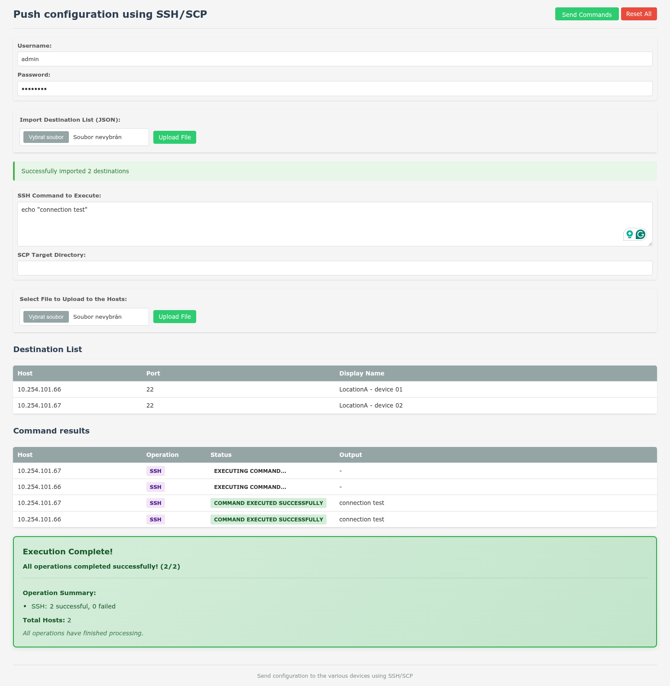

# netConfigure

A web-based SSH/SCP configuration management tool for deploying files and executing commands across multiple remote hosts simultaneously.



## Required applications
- sshpass
- ssh
- scp

## Usage
### Install
- Manually: pre-compiled executable files can be found in `bin` directory
- Package: debian `.deb` package can be found in `debian-pkg` directory, install using `dpkg -i package.deb`

### Run
- Manually: Execute binary file manually and open web page at http://localhost:8080
- Systemd service: systemctl status/start/stop/disable/enable netconfigure.service
- Systemd configuration file located in `/etc/default/netconfigure`

### Startup options
- listenAddr string, Server listen address (default all)
- listenPort int, Server listen port (default 8080)

### 1. Authentication
- Enter your SSH username and password in the configuration section

### 2. Import Destination Hosts
- Prepare a JSON file containing your host configurations. A port value is optional:
```json
[
  {
    "address": "192.168.1.100",
    "port": 22
  },
  {
    "address": "192.168.1.101",
    "port": 2222
  }
]
```
- Click "Upload File" to import your destination list

### 3. Configure Operations
- **SSH Command**: Enter the command to execute on remote hosts
- **SCP Target Directory**: Specify the destination directory for file uploads if necessary
- **File Upload**: Select a file to transfer to all hosts if necessary

### Post-install tips
- App use web socket
- Secure app access using apache/nginx/htaccess proxy example (destination address `10.10.20.38:8080`)
```
<VirtualHost *:443>
    ServerName XXXXXXXXXXXXXXXXXXx

    <Location />
        AuthType Basic
        AuthName "Restricted Access"
        AuthUserFile /etc/apache2/.htpasswd
        Require valid-user
    </Location>

    # Enable proxy and preserve host
    ProxyPreserveHost On
    ProxyRequests Off
    
    # WebSocket proxy configuration
    # This handles the WebSocket upgrade requests
    ProxyPass /ws/ ws://10.10.20.38:8080/ws/
    ProxyPassReverse /ws/ ws://10.10.20.38:8080/ws/

    # HTTP proxy
    ProxyPass / http://10.10.20.38:8080/
    ProxyPassReverse / http://10.10.20.38:8080/
    
    # Rewrite rules for WebSocket
    RewriteEngine On
    RewriteCond %{HTTP:Upgrade} websocket [NC]
    RewriteCond %{HTTP:Connection} upgrade [NC]
    RewriteRule ^/?(.*) "ws://10.10.20.38:8080/$1" [P,L]
    
    ErrorLog ${APACHE_LOG_DIR}/error.log
    CustomLog ${APACHE_LOG_DIR}/access.log combined
SSLCertificateFile XXXXXXXXXXXXXXXXXXx
SSLCertificateKeyFile XXXXXXXXXXXXXXXXXXx
Include /etc/letsencrypt/options-ssl-apache.conf
</VirtualHost>

```